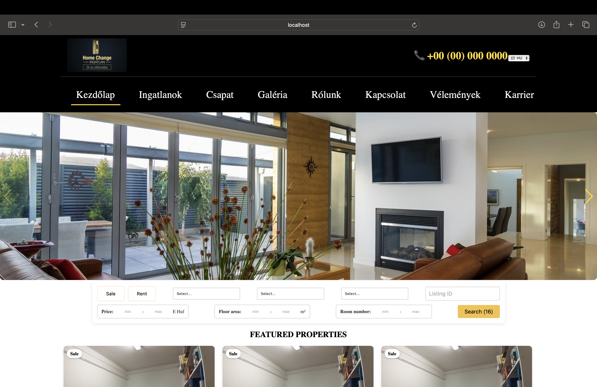
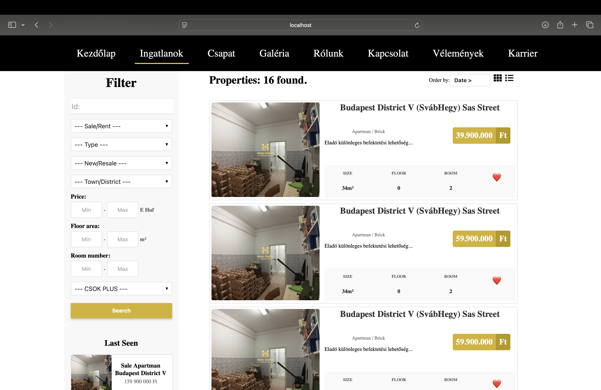

# 🏡 Real Estate Agency – Marketing Web Application

A modern, responsive real estate marketing web application currently under development for public client use. 
It showcases available properties and the agency's team, allowing users to search, browse, and view listings.

This marketing site will serve as the public-facing platform, while a separate internal CRM system 
is planned for future development. The CRM will not be publicly accessible and will handle administrative and management functionalities.

### Homepage

### Properties List

---

## ⚙️ Technologies

### Frontend
  - 🧠 React + TypeScript
  - 🎨 Classic CSS for styling & responsiveness
  - 🌐 i18next – internationalization support (in progress)
  - ⭐ fontawesome & react-icons – for icons

### Backend *(connected, but currently using dummy data)*
  - 🚀 ASP.NET Core (C#)
  - 🗄️ `Entity Framework Core`
  - 🧠 `MSSQL` – relational database

---

## 📌 Current Features

### 🌐 General
  - ✅ Full routing setup
  - ✅ Header, Footer, SearchBars
  - ✅ Multilingual support via i18next (not ready yet)

### 🏘️ Home Page
  - ✅ Property cards rendered using dummy data
  - ✅ Last seen properties
  Property Cards:
  - ✅ Clickable cards navigate to dedicated Property pages (Print and share buttons)
  - 🔄 Image slider (gallery)
  - 📝 Property description
  - 👤 Realtor card (contact person)

### 🗂️ Properties Page (`/properties`)
  - ✅ Toggle between grid and list view
  - ✅ Pagination support
  - ✅ Filtering by price and upload date
  - ✅ "Last seen" feature
  - ✅ Search using search bar

### 👥 Team Page (`/team`)
  - ✅ Agent cards (name, contact, title)
  - ✅ Agent bio-page
  - ✅ Agent properties in properties page

---

## 🧪 Setup & Running Locally
  - git clone
  - npm i
  - npm run dev
